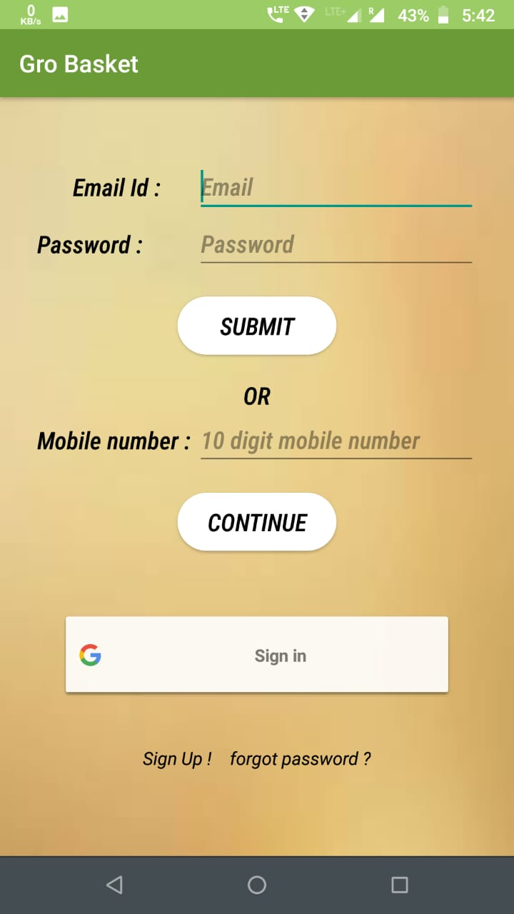
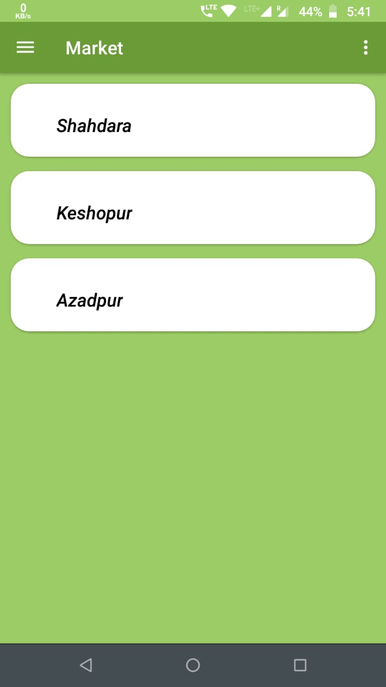
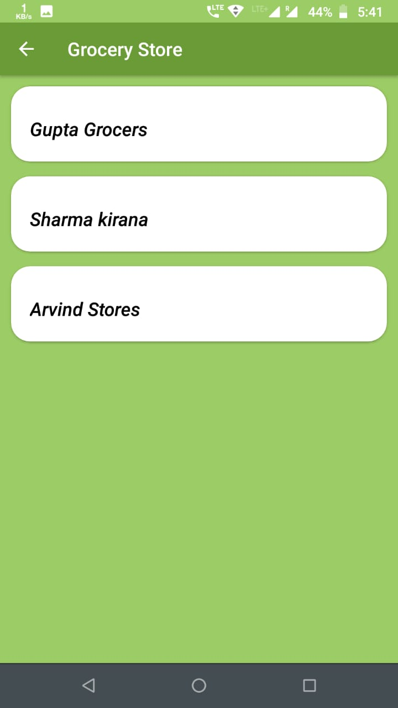
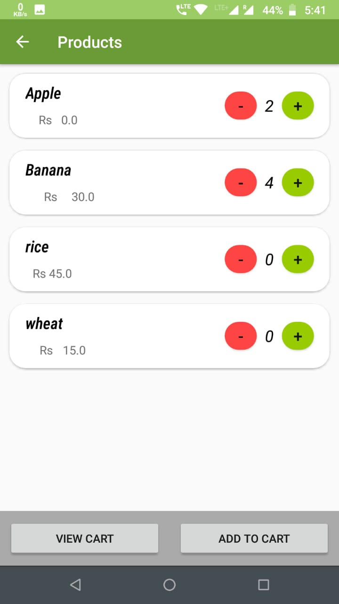
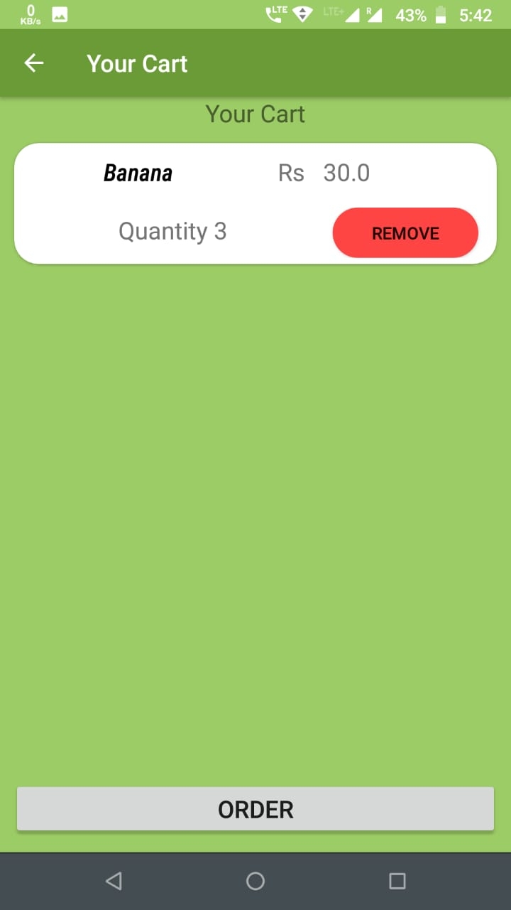
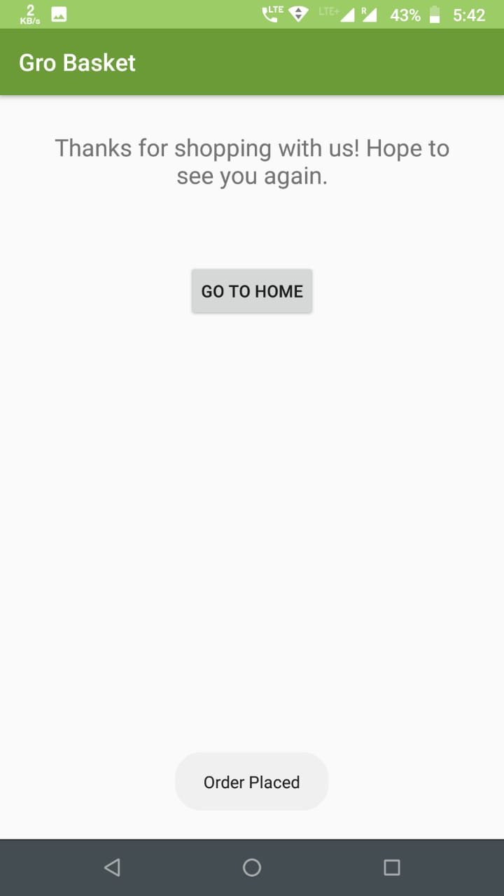

# Gro Basket
Grocery Application based on dynamic pricing with user friendly UI .
It is an android application which helps customers to purchase groceries online. It also has some advance features for dynamic pricing so as to change price of commodities based on some admin given conditions and customer demand.

- - -
### Sign in Page Preview

 
 
### Market Catalogue Page Preview   

### Grocery Stores Page Preview  

### Products catalogue Page Preview   

### Cart Page Preview   

### Acknowlegement Page Preview    

